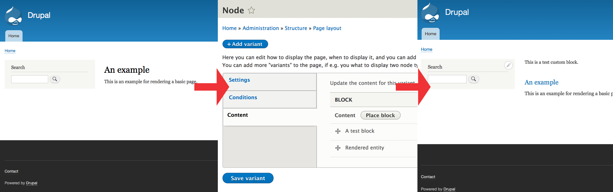
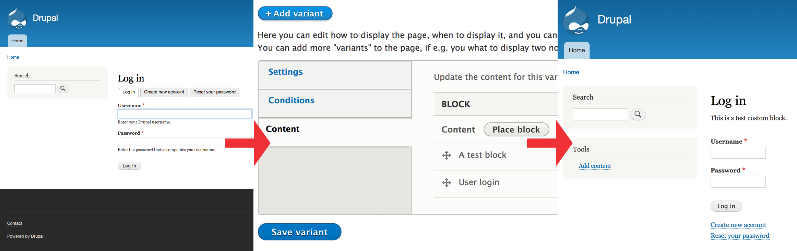

INTRODUCTION
------------

With Page Layout, you can create new pages (or paths, i.e. /about), and put content onto them, by placing blocks - much like the Block Layout page.
Each page can define multiple variants, where each variant can have their own set of conditions when to be selected.
It’s also possible to overwrite existing pages and content types. i.e. node, by defining a page with path `/node/%`.

 * For a full description of the module, visit the project page:
   https://www.drupal.org/sandbox/kaa4ever/2811171

 * To submit bug reports and feature suggestions, or to track changes:
   https://www.drupal.org/project/issues/2811171
   
REQUIREMENTS
------------

This module requires the following modules:

 * Layout Plugin (https://www.drupal.org/project/layout_plugin)
 
INSTALLATION
------------
 
Install as you would normally install a contributed Drupal module. See:
https://www.drupal.org/docs/8/extending-drupal/installing-contributed-modules-find-import-enable-configure for further information.
   
CONFIGURATION
-------------

When enabling this module, it will have no initial impact on your site.
However, you can access the Configuration page at Structure » Page Layout, and start setting up pages to control.

When the module is uninstalled, everything will be reverted to before the installation.

EXAMPLE
-------------

In this example, the default rendering of a node view and the user login has been overwritten 
by __Page Layout__.

### Node view

  
### User login

  

MAINTAINERS
-----------

Current maintainers:
 * Kristian Kaa (kaa4ever) - https://www.drupal.org/u/kaa4ever 
